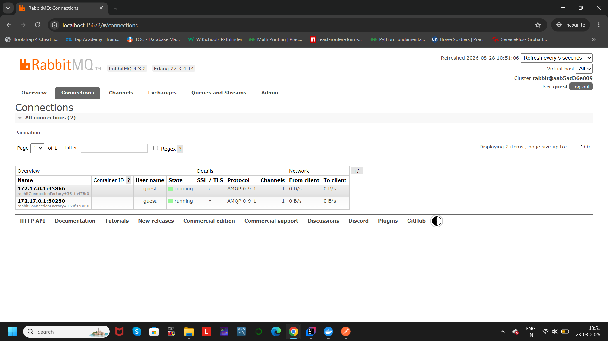

# 🏋️ AI Fitness Tracker 🚀

An AI-powered fitness tracking application that analyzes user workout activities and provides personalized fitness recommendations using Large Language Models.

The application follows a **microservices architecture** where user activities are processed asynchronously using RabbitMQ and AI-generated insights are provided using the Groq LLM API.

---

# 📌 Features

- User management and authentication
- Track fitness activities such as running, walking, cycling etc.
- Store and manage user workout data
- Asynchronous communication between services using RabbitMQ
- AI-powered fitness analysis and recommendations
- Personalized workout improvement suggestions
- AI-generated insights based on:
    - Activity duration
    - Calories burned
    - Distance covered
    - Heart rate
    - Workout type
- Service discovery using Eureka Server
- REST API based communication

---

# 🏗️ System Architecture

```
                User
                  |
                  |
          User Service
                  |
                  |
        Activity Service
                  |
                  |
            RabbitMQ
                  |
                  |
          AI Service
                  |
                  |
          Groq LLM API
                  |
                  |
     Personalized Fitness Recommendation
```

---

# 🔄 Application Workflow

1. User registers and manages profile through User Service.

2. User records fitness activities through Activity Service.

3. Activity Service stores activity details in the database.

4. Activity data is published to RabbitMQ message queue.

5. AI Service consumes activity messages asynchronously.

6. AI Service sends activity details to Groq LLM API.

7. AI model analyzes the activity and generates:
    - Performance analysis
    - Improvement suggestions
    - Workout recommendations
    - Safety tips

8. Generated recommendations are stored and can be retrieved later.

---

# 🛠️ Tech Stack

## Backend

- Java 21
- Spring Boot
- Spring Data JPA
- Spring Web
- REST APIs
- Maven

## Microservices

- User Service
- Activity Service
- AI Service
- Eureka Server

## Messaging

- RabbitMQ
- Spring AMQP

## Database

- PostgreSQL

## AI Integration

- Groq API
- Large Language Model (LLM)
- Prompt Engineering

## Development Tools

- IntelliJ IDEA
- Postman
- Docker
- Git & GitHub

---

# 📂 Project Structure

```
AI Fitness Tracker

│
├── userservice
│   └── User management microservice
│
├── activityservice
│   └── Activity tracking and message publishing
│
├── aiservice
│   └── AI recommendation generation
│
├── eureka
│   └── Service discovery server
│
└── Images
    └── Project screenshots
```

---

# ⚙️ Setup Instructions

## 1. Clone Repository

```bash
git clone <your-github-repository-link>
```

Navigate into the project folder:

```bash
cd AI-Fitness-Tracker
```

---

# 2. Configure Environment Variables

The application requires Groq API credentials.

Create environment variables:

```
GROQ_API_URL=https://api.groq.com/openai/v1/chat/completions

GROQ_API_KEY=<your_api_key>
```

⚠️ Do not expose your API keys publicly.

---

# 3. Start RabbitMQ

Run RabbitMQ using Docker:

```bash
docker run -d --name rabbitmq \
-p 5672:5672 \
-p 15672:15672 \
rabbitmq:4-management
```

RabbitMQ dashboard:

```
http://localhost:15672
```

---

# 4. Start Eureka Server

Navigate to Eureka service:

```bash
cd eureka
```

Run:

```bash
./mvnw spring-boot:run
```

Eureka Dashboard:

```
http://localhost:8761
```

---

# 5. Start User Service

Navigate:

```bash
cd userservice
```

Run:

```bash
./mvnw spring-boot:run
```

---

# 6. Start Activity Service

Navigate:

```bash
cd activityservice
```

Run:

```bash
./mvnw spring-boot:run
```

---

# 7. Start AI Service

Navigate:

```bash
cd aiservice
```

Run:

```bash
./mvnw spring-boot:run
```

---

# 📸 Screenshots

## RabbitMQ Connection

RabbitMQ successfully connected with application services.




---

## RabbitMQ Queue

Activity messages are published into the activity queue.


---

## RabbitMQ Overview

RabbitMQ dashboard showing active exchanges, queues and consumers.


---

## AI Generated Fitness Recommendation

AI Service generates personalized recommendations using Groq LLM.


---

# 🧠 AI Recommendation Example

The AI Service analyzes workout information and generates:

### Performance Analysis

- Pace analysis
- Heart rate evaluation
- Calories burned analysis

### Improvement Suggestions

- Training improvements
- Recovery recommendations
- Strength and mobility suggestions

### Workout Suggestions

- Interval training
- Long distance training
- Hill repeats

### Safety Recommendations

- Hydration guidance
- Injury prevention tips

---

# 🚀 Future Enhancements

- Add frontend dashboard for users
- Implement JWT based authentication
- Deploy microservices on cloud platforms
- Add wearable device integration
- Add AI chatbot for fitness assistance
- Store historical fitness analytics
- Provide progress tracking and visualization

---

# 👩‍💻 Author

**Srujana M R**

GitHub:
https://github.com/sruj-na-07